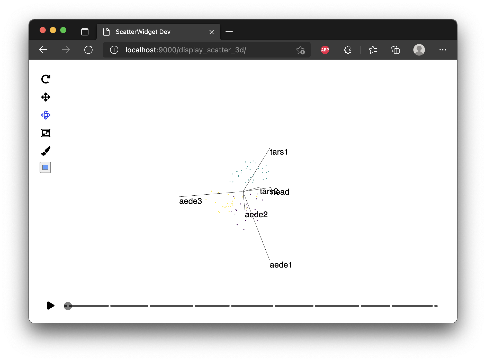

```{r, include = FALSE}
knitr::opts_chunk$set(
  collapse = TRUE,
  comment = "#>",
  out.width = "100%",
  fig.path = "figure/"
)
```

## Development setup

Now that our widget is up and running we can make changes to our TS code, rebuild the package, reload the R console, and view the changes by running `animate_tour` again.
This is quite slow, and doing it repetitively makes for a poor development experience, so in this section we will detail some additional configuration you can use to view changes to your widget in real time.

This is done using `webpack-dev-server`

```{sh, eval=FALSE}
yarn run start-dev
```

This starts a Webpack development server on `localhost:9000`, and opens a UI in the browser with links to each of the widgets in the `detourr` package, shown below:

```{r, echo=FALSE, out.width = "100%"}
knitr::include_graphics("images/dev_server_menu.png")
```

Clicking on any of these links will show the development widget in action, for example, clicking on  `display_scatter_3d` gives the below:


```{r, echo=FALSE, out.width="100%"}

```

In this section, we'll create our own basic widget, and make it accessible via `yarn run start-dev`.

```{r, eval=FALSE}
#' Display Hello World Example
#'
#' Note that these comments will be converted in to documentation by the
#' {roxygen2} package when we run `yarn run build`. As such, the `@export`
#' below is necessary, or else this function won't be made available to the
#' user
#'
#' @export
display_hello_world <- function() {
  init <- function(data, col_spec, tour_dim) {
    data_cols <- tidyselect::eval_select(col_spec, data)
    labels <- names(data_cols)
    widget <- "hello_world"

    list(
      "plot" = list(
        labels = labels
      ),
      "widget" = widget,
      "mapping" = list()
    )
  }
  list(
    "init" = init
  )
}
```


```{r, echo = FALSE, eval=FALSE}
knitr::include_graphics("images/browser_console.png")
```


Before we can run the above in the browser, we'll need to create two more files:

- `dev/hello_world/sample_data.json`: a file containing sample data that our widget will use.
- `dev/hello_world/index.html` will contain logic to import the class we defined above, load the sample data, and render our widget.


<p class="codeblock-label">dev/hello_world/sample_data.json</p>

```{js}
"hello sample data"
```

<p class="codeblock-label">dev/hello_world/static/index.html</p>

```{js, eval=FALSE}
<!DOCTYPE html>
<html lang="en">
  <head>
    <title>Hello World</title>
    <script src="hello_world.bundle.js"></script>
  </head>
  <body>
    <div id="plot"></div>
    <script>
      fetch("./sample_data.json").then(function (response) {
        // run hello_world using sample data
        response.json().then(function (data) {
          let el = document.getElementById("plot");
          let display = new window['hello_world/hello_world'].HelloWorld(el, 300, 300);
          display.renderValue(data);
          window.addEventListener("resize", (event) =>
            display.resize(window.innerWidth , window.innerHeight)
          );
        });
      });
    </script>
  </body>
</html>
```


With the above files in place, the next thing we need to do is tell Webpack that we want to bundle our `hello_world` example along with the existing widgets. This bundling is configured via `webpack/dev.config.ts`, and there are two changes we need to make to this file:

1. adding an item under `entry` to tell webpack where our TS code lives

<p class="codeblock-label">webpack/dev.config.ts</p>

```diff
  entry: {
    "display_scatter_2d/display_scatter_2d":
      "./srcts/display_scatter_2d/index.ts",
    "display_scatter_3d/display_scatter_3d":
      "./srcts/display_scatter_3d/index.ts",
+   "hello_world/hello_world": "./srcts/hello_world/index.ts",
  },
``` 

2. adding a new pattern under `CopyPlugin` to tell webpack where to find our `index.html` and `sample_data.json` files 

<p class="codeblock-label">webpack/dev.config.ts</p>

```diff
  plugins: [
      new CopyPlugin({
        patterns: [
          ...
+         { from: "dev/hello_world/static/", to: "hello_world" },
        ],
      }),
    ],
```

Lastly, we need to add a menu item so that we can navigate to our widget when the dev server is started. To do this, we modify `dev/index.ts` by adding a line to `dev/index.html` like so: 

<p class="codeblock-label">dev/index.html</p>

```diff
<!DOCTYPE html>
<html>
<head>
   <meta http-equiv="Content-Type" content="text/html; charset=utf-8">
   <title>Directory Tree</title>
</head>
<body>
  <h1>Development Widgets</h1><p>
  <a href="./display_scatter_2d/">display_scatter_2d</a><br>
  <a href="./display_scatter_3d/">display_scatter_3d</a><br>
+ <a href="./hello_world/">hello_world</a><br>
  <br><br>
</body>
</html>
```

Now, when we start our dev server using `yarn run start-dev`, we see our new menu option:

```{r, echo=FALSE, out.width = "100%"}
knitr::include_graphics("images/dev_server_hello_world_menu.png")
```

And we can navigate to our widget!

```{r, echo=FALSE, out.width = "100%"}
knitr::include_graphics("images/dev_server_hello_world.png")
```

With the above all set up, we can get started developing our widget in Typescript. The development server will watch our TS code for changes, and update immediately when those changes are saved. If our code is invalid, the dev server will tell us exactly where the issue is so that we can fix it. We can modify the contents of our `sample_data.json` file with the data we expect to receive from R, and then modify the TS code to consume that data.

## Creating R and javascript bindings

Once we've got a widget up and running using the dev server, we will need to integrate it in to the R package with {HTMLWidgets}. The steps in this section are very similar to , but there are some additional steps required for us to bundle our widget dependencies.


```
❯ ls -l inst/htmlwidgets/lib
.rw-r--r--  41k chart 30 Jan 13:44 display_scatter_2d.bundle.js
.rw-r--r--  40k chart 30 Jan 13:44 display_scatter_3d.bundle.js
.rw-r--r--  789 chart 30 Jan 13:44 hello_world.bundle.js
.rw-r--r-- 1.2k chart 12 Dec  2021 runtime.bundle.js
.rw-r--r-- 622k chart  7 Jan 14:05 three.bundle.js
.rw-r--r--   92 chart 12 Dec  2021 three.bundle.js.LICENSE.txt
```

The files that are important for us are `runtime.bundle.js` and `hello_world.bundle.js`. The `hello_world` bundle consists of our code, while `runtime.bundle.js` contains code for the webpack runtime, which is required for our widget to work. Later on, if our widget uses third party libraries as dependencies, they will be bundled separately and added to this folder, as is the case for `three.bundle.js`.

### Dependencies


More information on this file can be found in [the htmlwidgets documentation](https://www.htmlwidgets.org/develop_intro.html)


### R binding and display method

When make a call to `animate_tour`, we specify the `data`, `tour_path`, and `display_method` arguments. Technically speaking, the R binding we need (as detailed in [the htmlwidgets documentation](https://www.htmlwidgets.org/develop_intro.html)) is already implemented in the in the `animate_tour` function. To get our widget to show, however, we will need to implement a new display method which provides the necessary context to `animate_tour` for our widget to be called.


<p class="codeblock-label">R/display_hello_world.R</p>


### Javascript binding


## Some useful tips

Below are some useful tips to make things a little easier when developing widgets.

### Generating `sample_data.json`

Rather than creating and modifying `sample_data.json` by hand for your development widget, it's best to add some code to `scripts/generate_sample_data.R` to generate this file for you. For example:

<p class="codeblock-label">scripts/generate_sample_data.R</p>

```{r, eval=FALSE}
set.seed(1)

p <- animate_tour(
  tourr::flea,
  display = display_hello_world(),
  tour_path = grand_tour(3)
)

writeLines(
  jsonlite::toJSON(p$x, auto_unbox = TRUE, null = "null"),
  "../dev/hello_world/static/sample_data.json"
)
```
