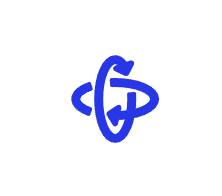
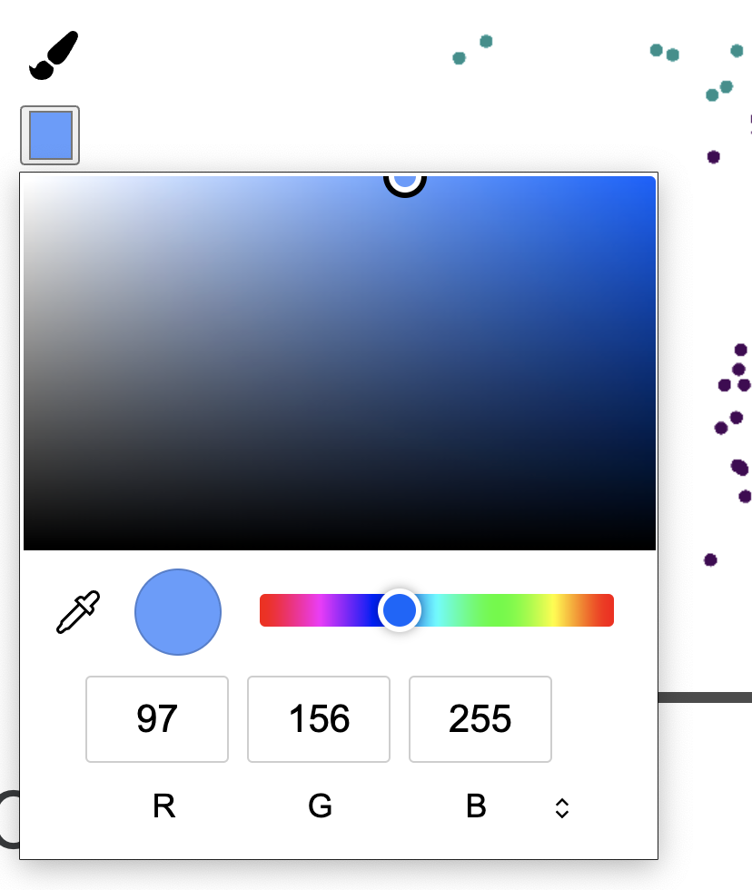
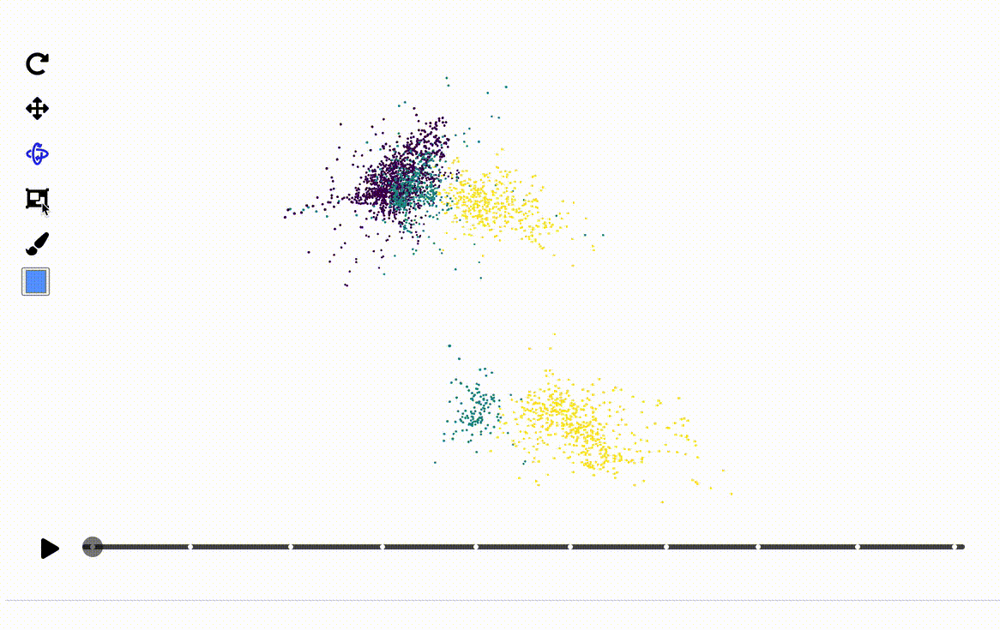
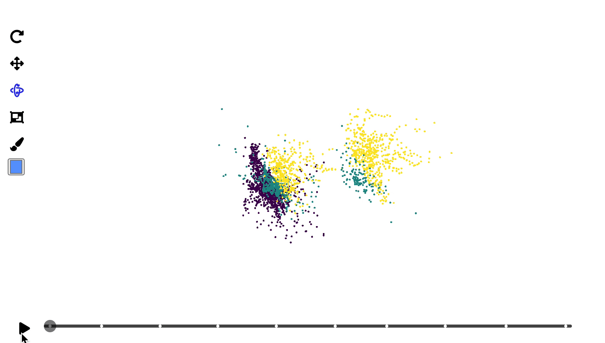
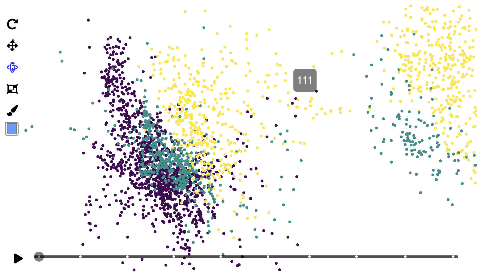

```{r, include = FALSE}
knitr::opts_chunk$set(
  collapse = TRUE,
  comment = "#>",
  out.width = "100%",
  fig.path = "figure/"
)
```

The detourr package consists of two very similar scatterplot displays; there's a 2D variant and a 3D variant, and both are produced using the `display_scatter` display method. Both of these have similar capabilities for user interaction, including point selection, brushing, orbit controls and more. In this vignette, we'll go through each of these in turn and describe how they can be used and configured.

## Examples

For the following examples, the `pdfsense` dataset will be used, with the tour path set to `grand_tour`. 
All of the interactivity described in this vignette can be demonstrated in these two examples, and the code that produced these visuals can be found in the [appendix](#appendix).

Below is the 2D variant of `display_scatter`:

```{r 2d-scatter, message=FALSE, echo=FALSE}
set.seed(1)

library(detourr)
library(dplyr)
data(pdfsense)

plot_data <-
  pdfsense %>%
  mutate(Type = as.character(Type)) %>%
  select(-(X11:X56))


animate_tour(
  plot_data,
  grand_tour(2),
  display_scatter(tour_aes(
    colour = Type,
    label = I(ID)
  ),
  axes = FALSE,
  alpha = 1,
  size = 0.5
  )
)
```

And the 3D variant:

```{r 3d-scatter, message=FALSE, echo=FALSE}
set.seed(1)

library(detourr)
library(dplyr)
data(pdfsense)

plot_data <-
  pdfsense %>%
  mutate(Type = as.character(Type)) %>%
  select(-(X11:X56))


animate_tour(
  plot_data,
  grand_tour(3),
  display_scatter(tour_aes(
    colour = Type,
    label = c(InFit, Type, ID, pt, x, mu)
  ),
  axes = FALSE,
  alpha = 1,
  size = 0.5
  )
)
```

----

## Controls

The following is a brief breakdown of the controls found on the left side of the visual

### Orbit controls

```{r, echo=FALSE, out.width="25%"}

```

When the `display_scatter` widget is generated, orbit controls will be enabled by default. This allows click and drag to rotate the visual, and scrolling to zoom. Note that orbit controls for the 2D variant work best if dragging from left to right, not up and down. 


### Panning

```{r, echo=FALSE, out.width="25%"}
knitr::include_graphics("images/pan_button.png")
```

The pan control also allows scrolling to zoom, and click and drag to pan.

### Point selection and brushing

The last three controls work together to allow for point selection and brushing.

```{r, echo=FALSE, out.width="25%"}
knitr::include_graphics("images/select_button.png")
```

The selection control above allows for box selection by clicking and dragging. Holding the `shift` key will allow for multiple selection, and points outside of the selection will be indicated by increased transparancy. There is currently a limitation where only visible points can be selected. If a point is completely obscured by other points, it will not be selected.

```{r, echo=FALSE, out.width="25%"}
knitr::include_graphics("images/brush.png")
```

The brush button will apply the current colour to the selected points.


```{r, echo=FALSE, out.width="25%"}

```

The colour selector will look slightly different depending on the browser being used. When the colour selection is changed, the selected points will be updated immediately.

Putting these selection tools together, we might use them like so:

```{r, echo=FALSE, out.width="80%"}

```

## Timeline controls

The timeline at the bottom of the widget controls play and pause, and allows for scrubbing to a specific point in the tour. 
The timeline can also be used to jump to a specific basis by clicking on any of the white basis markers, and hovering the mouse over the basis markers will display the index of that basis.

This funcionality is shown below:

```{r, echo=FALSE}

```

## Label aesthetics

In the above example, labels are defined within the call to `tour_aes`, which contains all of the aesthetic mappings for the tour. The `label` aesthetic produces a tooltip which is shown whenever the mouse is hovered over the data point:

```{r, echo = FALSE}
knitr::include_graphics("images/hover_tooltip.gif")
```

By default, the text in the tooltip will have the format `column_name: value`, with each specified column on a new line.
If you want more control over what appears in the tooltip, you can use the `I()` function so that the values in the aesthetic column appear as-is.
For example in the [2D scatter plot example](#examples), the `ID` column is specified as-is by using `tour_aes(label = I(ID))`:

```{r, echo = FALSE}

```

When using the `I()` function for the label aesthetic, only one column can be specified at a time.
To split text in the tooltip over multiple line, you will need to use `<br>` as the line break instead of `\n`.

## Conclusion

In this vignette we've demonstrated the interactivity of the `display_scatter` display method in the {detourr} package.
If you have any issues or suggestions, please open an issue on [github](https://github.com/casperhart/detourr/issues).

## Appendix

### 2D Scatter Plot
```{r, ref.label="2d-scatter", echo=TRUE, eval=FALSE}
```

### 3D Scatter Plot

```{r, ref.label="3d-scatter", echo=TRUE, eval=FALSE}
```

